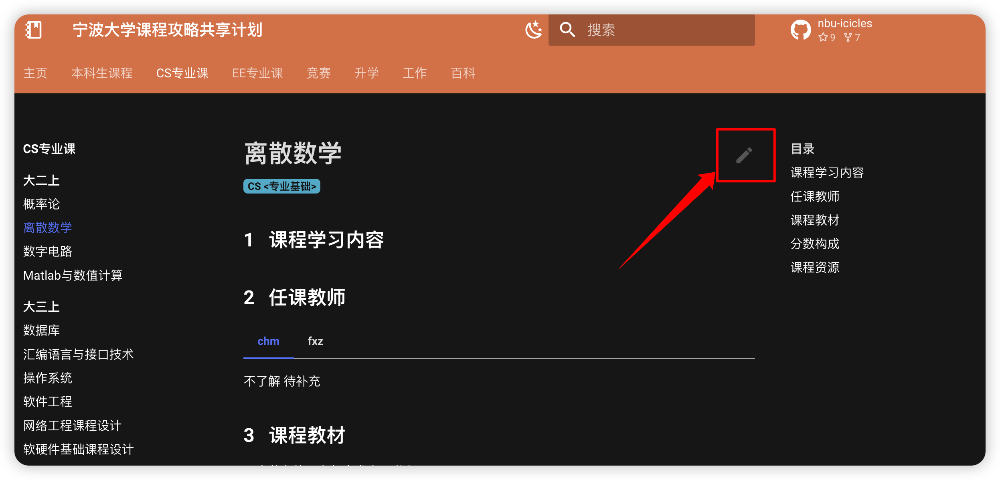
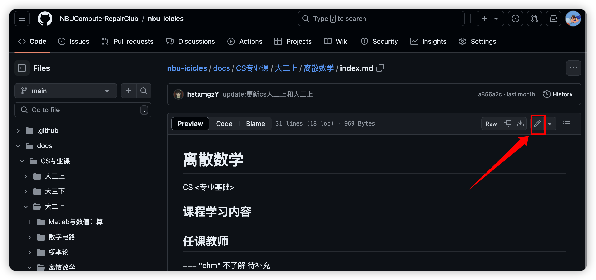
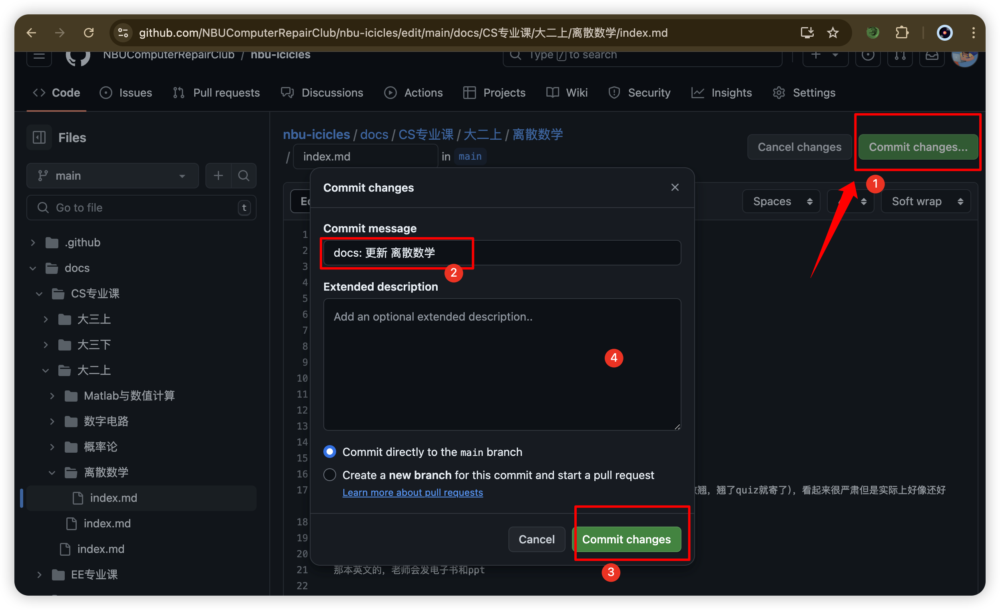

# 贡献指南

本网站欢迎一切贡献 🎉  

如果你想要为本网站进行贡献，以下是一些指南。

## 本地构建
1. 克隆本项目 repo
    ```shell
    $ git clone https://github.com/NBUComputerRepairClub/nbu-icicles.git
    $ cd nbu-icicles
    ```
2. 安装 python 依赖（mkdocs 以及 material）
    ```shell
    $ pip install -r requirements.txt
    ```

3. 启动 mkdocs 本地服务
    ```shell
    $ mkdocs serve
    ```
    如果不行可以试试
    ```shell
    $ python -m mkdocs serve
    ```
    - 之后即可通过浏览器访问 localhost:8000 预览网站

## 贡献内容
### 网站结构
课程正文按课程名称集中存放；专业与学期概览只负责索引，课程介绍、授课教师和资料链接写在同一份课程页面中。

在源代码层面，每门课程对应 `docs/课程/课程名.md`，不再为每门课程创建文件夹或 `index.md`。课程页开头的 YAML front matter 记录 `title`、`category` 和 `offerings`；`offerings` 中每项包含专业 `major` 与学期 `semester`，一门课可有多项。不分专业的课程写 `major: 通用`，无法从现有资料确定专业或学期时分别写 `未标注`、`未注明`。PDF、DOC、ZIP、图片等课程附件统一放在 `docs/assets/courses/课程名/`，正文使用相对链接。当前导航仍在 `mkdocs.yml` 的 `nav` 中维护。

```text
.
├── docs
│   ├── contributing.md     # 本页
│   ├── template.md         # 课程页面模板
│   ├── index.md            # 主页
│   ├── css/                # 本站用到的所有 css 样式
│   ├── images/             # 仅用来保存网站图标
│   ├── js/                 # 本站用到的所有 js 脚本
│   ├── 课程/                # 一个课程一份「课程名.md」
│   ├── assets/courses/      # 课程附件
│   ├── 本科生课程/          # 本科生概览与课程分类页面
│   ├── 学院汇总/            # 按学院归档专业速查页（CS.md、ECE.md、EI.md、EE.md）
│   ├── ....
├── mkdocs.yml          # mkdocs 站点设置
├── overrides/          # mkdocs-material 个性主题设置
└── requirements.txt    # 本站构建所需全部 python 依赖
```

### 贡献守则
你可以对本网站进行任何贡献，包括完善、更新页面内容，添加新页面，样式修改等等。

如果是添加新页面的话，请记得同时更新好 `mkdocs.yml` 的 `nav` 部分，使新页面能够正常通过站点目录被访问。

对于页面内容：

- 对于课程请进行客观的评价，尽量不要带有主观色彩（比较主观的内容可以在页面下评论）
- 对于外部资源，请尽量插入链接，不要将文件传入本 repo
- 尽量不要上传有版权的文件，例如课件等
- 对于自己的笔记、复习提纲等材料：
    - 如果有自己的网站，推荐放在自己的网站并在此插入链接
    - 也可以把适合入库的附件放在 `docs/assets/courses/课程名/`，并从课程页使用相对链接，例如 `../assets/courses/数值计算/main.pdf`
- 尽量规范编写 markdown，避免出现格式错误
    - 如果你实在搞不定，不要担心，尽管上传，我们发现后会及时进行修改

!!! note
    针对还完全没有内容的空页面，我们提供了一个[模板](./template.md)，可以在模板的[源码](https://github.com/NBUComputerRepairClub/nbu-icicles/blob/main/docs/template.md?plain=1)基础上修改使用。

### 贡献方式
#### Pull Request（推荐）
推荐通过 PR（即 Pull Request）的形式来进行贡献，具体流程：

- 在 GitHub 网页端点击右上角的 fork，将本仓库 fork 到自己的账号下
- 在自己账号的对应仓库中进行修改
- 修改完成后，点击 New pull request，提交一个 PR
- 等待其他人审核、修改，然后合并到本 repo 中

#### 直接提交
对于在 Organization 中的同学，如果实在觉得 PR 过程有些复杂，也可以直接修改、提交到本仓库中（可以在线修改，也可以 clone 到本地修改然后 commit、push）。如果在提交中存在问题，我们后续会及时进行修改。（不过还是不推荐这种方式）

!!! note
    可以直接通过网站顶部的页面标题右侧的编辑按钮 :material-pencil: 定位到对应的 GitHub 页面进行修改。




最后点击commit changes 就修改成功啦
## 问题反馈
如果你发现本网站内容存在问题，请优先在对应页面下方评论区中进行评论，或者在 repo 中开一个 issue 来提出问题。

如果你发现本网站存在侵犯您权益的内容，请通过 issue 联系我们，我们会进行删除。
