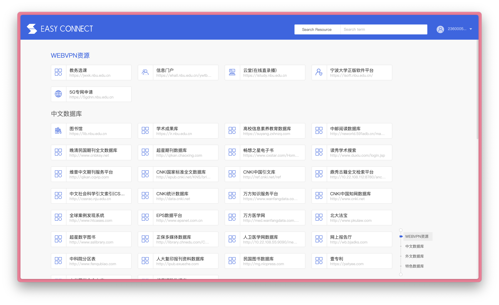

# 关于选课
## 选课系统打开方式
### 几个网址

- 宁大官网:[https://www.nbu.edu.cn/](https://www.nbu.edu.cn/)

- 宁大VPN（后面介绍用途）：[https://vpn.nbu.edu.cn/portal/#!/service](https://vpn.nbu.edu.cn/portal/#!/service)
    - 正常显示界面：
    - 

### 选课方法：
- (高亮字体均可点击访问网址，但是建议“在新标签页打开”)

1. **非校园网环境**选课:
    打开[宁大VPN](https://vpn.nbu.edu.cn/portal/#!/service)

