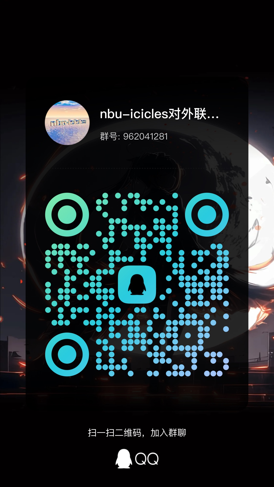

# 宁波大学住宿信息(建设中)
# 事先声明：
- 本文中所有信息来自于2025年5月2日前的问卷星自费调查结果，大部分来自`电脑维修社服务群(群号622502959)`
- 其中，有效问卷41份，无效问卷1份
- 附[问卷链接](https://1drv.ms/x/c/1e576e22bca503f4/EZAo4N10tBFEq26S5p8CjqgBVMDDnOGH2G8aA233Q5_9oA?e=iRkxlx)
- (有确切信息或更正请移步文末联系方式)

# 宁波大学宿舍分区
## 本科生公寓
- 本部宿舍
- 甬江公寓
- 甬江公寓7号楼（新楼，单算）
- 北区学生二村（北区学生公寓）
- 
## 研究生公寓
- 甬研公寓
- 南门公寓
- 

# 详细内容
## 甬江公寓7号楼(仅有两份，数据存疑?)
### 具体信息
1. 男女分区域居住：
    i. 男生`1-7层`
    ii. 女生`8-16层`
2. 寝室人数：4人寝
3. 卫浴：
    - 卫浴分离，一个卫生间、一个浴室
4. 床：
    - 200x95
### 特别点
- 当前宁波大学最新最好的宿舍！
- 有 电梯、刷卡进门等 只会出现在短视频里的内容！
---
## 北区学生二村
### 具体信息
1. 四人寝
2. 纯男&女寝
    - 男生寝室：`2、3、4、5、6、8号楼`
    - 女生寝室：`1、10号楼`
3. 卫浴信息:
    - 北区1、2、8、10号楼：
        - 一个卫生间，一个浴室
    - 北区3、4、5号楼
        - 公共卫浴
4. 地面信息：
    - 均为木质地板
    - （据称实则为仿木质水泥砖）
5. 寝室布局：
    - 均为上床下桌
6. 床尺寸：
    - 190x85 or 90
---
# 联系方式以及数据提交
=== "问卷星"
    可以直接填写问卷星问卷提交资料
    
=== "微信公众号" 
    - 可以在公众号留言
    

=== "QQ对外联系群"
    - 可以加入联络群讨论
    
---
# 未完待续
